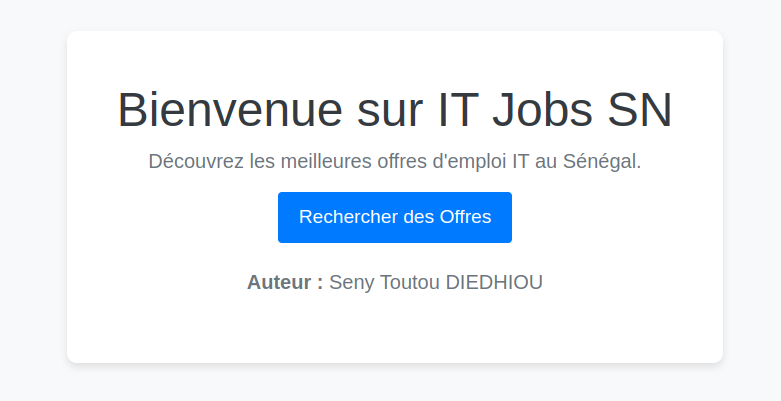
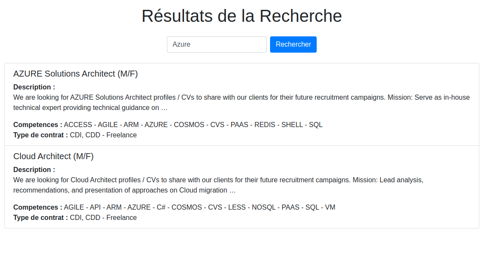
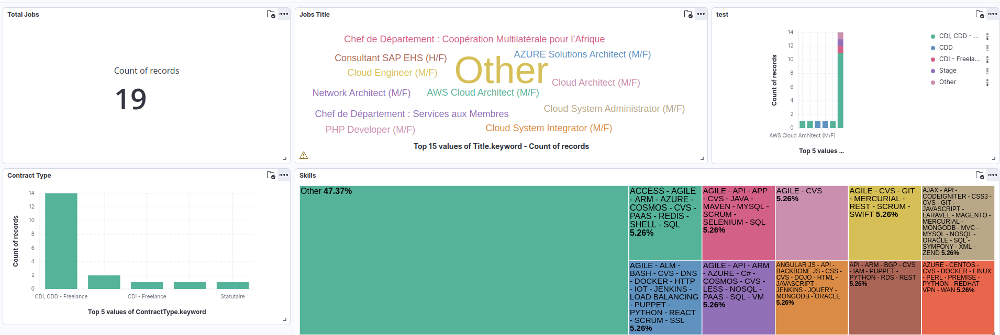

**Seny Toutou DIEDHIOU** \
**ODC DEV DATA P6**

# Projet : Moteur de Recherche des Offres d'Emploi IT avec Django

Ce projet consiste à récupérer, traiter, et analyser des offres d'emploi IT depuis l'API Microsoft LinkedIn, puis à les stocker dans Elasticsearch. Enfin, un tableau de bord sera créé dans Kibana pour visualiser les tendances des données collectées.

## Prérequis

- **Python 3.11**
- **Django**
- **Elasticsearch** (Local ou Cloud)
- **Kibana** (pour la visualisation)
- **API Microsoft LinkedIn**
- **Bibliothèques Python :**
  - `elasticsearch`
  - `pandas`
  - `requests`
  - `django`

## Installation

1. **Cloner le dépôt :**

   ```bash
   git clone https://github.com/setoudie/ELK_Project.git

   cd ELK_Project
   ```

2. **Créer et activer un environnement virtuel :**

   ```bash
   python3 -m venv venv
   source venv/bin/activate  # Sur Windows : venv\Scripts\activate
   ```

3. **Installer les dépendances :**

   ```bash
   pip install -r requirements.txt
   ```

4. **Configurer la base de données Elasticsearch :**

   Assurez-vous qu'Elasticsearch est installé et configuré correctement sur votre machine ou dans le cloud.

Les donnees ont etes scrapes sur https://www.emploisenegal.com/ et stockes dans un json file : `EmploisSenegal_IT_jobs.json`. Un petit traitement est fait sur ce fichier pour transformer chaque ligne en document. Ainsi chaque document est indexe et stocke dans elasticsearch.
```python
client = Elasticsearch(
    'https://localhost:9200',
    basic_auth=('username', 'password'),
    verify_certs=False
)

resp = client.index(index="job-it-senegal", id=i, document=doc)
```

## Structure du Projet

```
├── ELK_project/                 # Répertoire principal du projet Django
│   ├── ELK_project/             # Répertoire de configuration Django
│   ├── it_jobs/                 # App Django pour gérer les jobs IT
│   ├── Data/                    # Repertoire contenant les donnnes scrapes
│   ├── templates/               # Répertoire pour les templates HTML
│   ├── manage.py                # Commande de gestion Django
│   ├── requirements.txt         # Liste des dépendances Python
│   └── README.md                # Documentation du projet
├── venv/                        # Environnement virtuel
```

## Exécution
1. **Creation de l'app django pour faire des recherches**

   ```bash
   python manage.py startapp it_jobs

   ```
Cette app contient deux views: 
* `index` c'est la page d'acceuil : http://localhost:8000/it-jobs-sn/

```python
def index(request):
    return render(request, 'it_jobs/index.html')
```
* `search_views` c'est la page pour chercher un poste par mot cle : http://localhost:8000/it-jobs-sn/search/

```python
def search_view(request):
    client = Elasticsearch(
        'https://localhost:9200',
        basic_auth=('elastics', 'elastic'),
        verify_certs=False
    )
    query = request.GET.get('q')

    found_data = []
    if query:
        response = client.search(index='job-it-senegal', body={
            "query": {
                "match": {
                    "Description": query
                }
            }
        })
        # print(response)
        results = response['hits']['hits']

        for i in range(len(results)):
            found_data.append(results[i]['_source'])
        # print(len(found_data), found_data)

    return render(request, 'it_jobs/search.html', {'found_datas': found_data})

```
```text
response --> {'took': 1, 'timed_out': False, '_shards': {'total': 1, 'successful': 1, 'skipped': 0, 'failed': 0}, 'hits': {'total': {'value': 2, 'relation': 'eq'}, 'max_score': 3.269783, 'hits': [{'_index': 'job-it-senegal', '_id': '17', '_score': 3.269783, '_ignored': ['Description.keyword'], '_source': {'Title': 'AZURE Solutions Architect (M/F)', 'Description': ' We are looking for\xa0 AZURE Solutions Architect  profiles / CVs to share with our clients for their future recruitment campaigns. \n \xa0 \n  Mission:  \xa0 \n \n      Serve as in-house technical expert providing technical guidance on new features & functionalities, drive the deployment of the customers workloads into Azure and provide deployment guidance.  \n      Deliver Cloud platform architecture documents detailing the vision for how Azure infrastructure and platform services support the overall application architecture.  \n      Proven background in the design and implementation of large scale, global, complex custom application development systems (e.g., high transaction volumes).  \n      Experience problem solving... ', 'ContractType': 'CDI, CDD - Freelance', 'Skills': 'ACCESS - AGILE - ARM - AZURE - COSMOS - CVS - PAAS - REDIS - SHELL - SQL'}}, {'_index': 'job-it-senegal', '_id': '18', '_score': 2.121358, '_ignored': ['Description.keyword'], '_source': {'Title': 'Cloud Architect (M/F)', 'Description': ' We are looking for\xa0 Cloud Architect  profiles / CVs to share with our clients for their future recruitment campaigns. \n \xa0 \n  Mission:  \xa0 \n \n      Lead analysis, recommendations, and presentation of approaches on Cloud migration roadmaps, architecture / designs etc.  \n      Involve in conducting Azure readiness assessments and evaluations and delivery of assessment reports, architecture/design/ deployment documents & presentations.  \n      Architecting Cloud solutions for new applications.  \n      Design Cloud architectures, environments, and solutions that meet the business requirements with an emphasis on meeting the overall business goals.  \n      Design highly available, scalable and secure solutions using... ', 'ContractType': 'CDI, CDD - Freelance', 'Skills': 'AGILE - API - ARM - AZURE - C# - COSMOS - CVS - LESS - NOSQL - PAAS - SQL - VM'}}]}}

results --> [{'_index': 'job-it-senegal', '_id': '17', '_score': 3.269783, '_ignored': ['Description.keyword'], '_source': {'Title': 'AZURE Solutions Architect (M/F)', 'Description': ' We are looking for\xa0 AZURE Solutions Architect  profiles / CVs to share with our clients for their future recruitment campaigns. \n \xa0 \n  Mission:  \xa0 \n \n      Serve as in-house technical expert providing technical guidance on new features & functionalities, drive the deployment of the customers workloads into Azure and provide deployment guidance.  \n      Deliver Cloud platform architecture documents detailing the vision for how Azure infrastructure and platform services support the overall application architecture.  \n      Proven background in the design and implementation of large scale, global, complex custom application development systems (e.g., high transaction volumes).  \n      Experience problem solving... ', 'ContractType': 'CDI, CDD - Freelance', 'Skills': 'ACCESS - AGILE - ARM - AZURE - COSMOS - CVS - PAAS - REDIS - SHELL - SQL'}}, {'_index': 'job-it-senegal', '_id': '18', '_score': 2.121358, '_ignored': ['Description.keyword'], '_source': {'Title': 'Cloud Architect (M/F)', 'Description': ' We are looking for\xa0 Cloud Architect  profiles / CVs to share with our clients for their future recruitment campaigns. \n \xa0 \n  Mission:  \xa0 \n \n      Lead analysis, recommendations, and presentation of approaches on Cloud migration roadmaps, architecture / designs etc.  \n      Involve in conducting Azure readiness assessments and evaluations and delivery of assessment reports, architecture/design/ deployment documents & presentations.  \n      Architecting Cloud solutions for new applications.  \n      Design Cloud architectures, environments, and solutions that meet the business requirements with an emphasis on meeting the overall business goals.  \n      Design highly available, scalable and secure solutions using... ', 'ContractType': 'CDI, CDD - Freelance', 'Skills': 'AGILE - API - ARM - AZURE - C# - COSMOS - CVS - LESS - NOSQL - PAAS - SQL - VM'}}]

found_data --> [{'Title': 'AZURE Solutions Architect (M/F)', 'Description': ' We are looking for\xa0 AZURE Solutions Architect  profiles / CVs to share with our clients for their future recruitment campaigns. \n \xa0 \n  Mission:  \xa0 \n \n      Serve as in-house technical expert providing technical guidance on new features & functionalities, drive the deployment of the customers workloads into Azure and provide deployment guidance.  \n      Deliver Cloud platform architecture documents detailing the vision for how Azure infrastructure and platform services support the overall application architecture.  \n      Proven background in the design and implementation of large scale, global, complex custom application development systems (e.g., high transaction volumes).  \n      Experience problem solving... ', 'ContractType': 'CDI, CDD - Freelance', 'Skills': 'ACCESS - AGILE - ARM - AZURE - COSMOS - CVS - PAAS - REDIS - SHELL - SQL'}, {'Title': 'Cloud Architect (M/F)', 'Description': ' We are looking for\xa0 Cloud Architect  profiles / CVs to share with our clients for their future recruitment campaigns. \n \xa0 \n  Mission:  \xa0 \n \n      Lead analysis, recommendations, and presentation of approaches on Cloud migration roadmaps, architecture / designs etc.  \n      Involve in conducting Azure readiness assessments and evaluations and delivery of assessment reports, architecture/design/ deployment documents & presentations.  \n      Architecting Cloud solutions for new applications.  \n      Design Cloud architectures, environments, and solutions that meet the business requirements with an emphasis on meeting the overall business goals.  \n      Design highly available, scalable and secure solutions using... ', 'ContractType': 'CDI, CDD - Freelance', 'Skills': 'AGILE - API - ARM - AZURE - C# - COSMOS - CVS - LESS - NOSQL - PAAS - SQL - VM'}]

```
2. **Démarrer le serveur Django :**

   ```bash
   python manage.py runserver
   ```


3. **Visualiser les données dans Kibana :**

   Et avec les donnes mis dans kibana on obtient ce visuel :


## Conclusion

Ce projet permet de créer un moteur de recherche spécialisé pour les offres d'emploi IT , Django pour la creation d'une app de recherche de données, Elasticsearch pour l'indexation, et Kibana pour la visualisation.\
apres mou diekh :) 